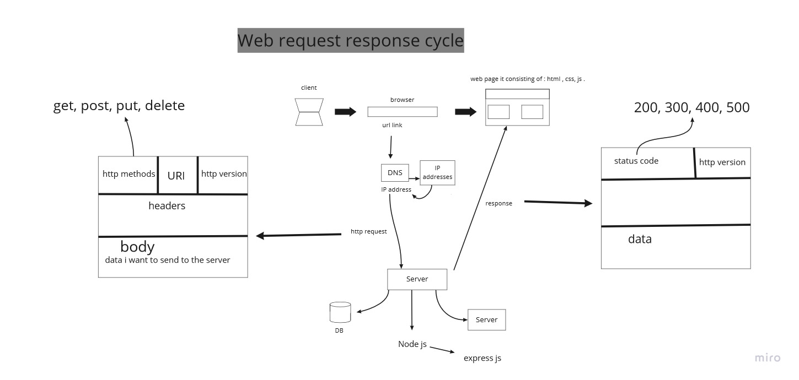

# Movies-Library
# Movies-Library - 1

**Author Name**: Roaa hailat

## WRRC

## Overview

## Getting Started
<!-- What are the steps that a user must take in order to build this app on their own machine and get it running? -->
first we shoulde install the cors and express packages and then we can use them for creating the server. before creating the server we use the methode **require('express')** and **require('cors')** to grabbing the main Express and cors module from the package we installed. and then we can create the server by using the **express()** function. then we use **server.get** to tell our Express server how to handle a **GET** request to our server. Express includes similar functions for **POST**, **PUT** , using **server.post** and **server.put**. the **get** function contain the name of the function that We can use it to read data about what the client is requesting to do. when we finish building the app we can run it using npm start.
## Project Features
<!-- What are the features included in you app -->
- Easy to Use.
- Well Designed and Functional.
- Readily accessible contact and location.